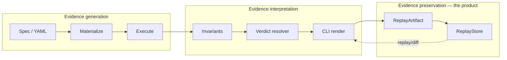

# FalsifyAI

> **FalsifyAI produces replayable, inspectable evidence that AI systems behave reliably under realistic pressure.**

Most evaluation tools produce metrics. FalsifyAI produces **evidence** — durable, structured artifacts that survive the run and let you *support* reliability claims about a model migration with preserved, inspectable proof.

[](https://github.com/ericckzhou/falsifyai/actions/workflows/ci.yml)
[](https://www.python.org)
[](LICENSE)

**Status:** 0.1.0 — Phase 0 MVP. Stable enough to use; spec language and verdict semantics are locked for the 0.1.x line.

```bash
pip install falsifyai
```

For the `semantic_equivalence` invariant (pulls PyTorch, ~1GB):

```bash
pip install "falsifyai[semantic]"
```

---

## What kind of tool is this?

FalsifyAI is **evidence infrastructure for reliability claims about stochastic systems** — most immediately, LLMs.

Think of it the way you'd think of:

| Domain | Evidence infrastructure |
|---|---|
| Software supply chain | **SBOM** (CycloneDX, SPDX) — what's in this build, with provenance |
| Static analysis | **SARIF** — the structured record of what was scanned and found |
| Build provenance | **Sigstore / in-toto** — cryptographic attestations about what was built and by whom |
| Security events | **Audit logs** — preserved, inspectable, defensible after the fact |
| **Stochastic-system reliability** | **FalsifyAI replay artifact** — preserved, inspectable, defensible evidence that a model behaved reliably under realistic pressure |

The underlying pattern isn't new. Applying it to stochastic-system reliability is. FalsifyAI is the stochastic-systems analogue of an evidence layer you already know.

The novelty isn't *that* we preserve evidence — it's *what* we preserve: every perturbed input, every model output, every invariant judgment, the verdict, the materialized spec, and the identity that ties them together. The CLI compresses; **the artifact preserves the receipts**.

---

## The core terms

Three definitions that anchor everything else in this document:

**Stochastic software** can produce meaningfully different outputs for equivalent requests due to probabilistic inference, retrieval variability, tool interactions, or adaptive behavior. LLMs are the most common case today; future AI systems will extend the category.

**A reliability claim** is a bounded statement about how a stochastic system behaves under specified perturbation pressure, judged by specified invariants. *"This case is STABLE under typo_noise and casing"* is a reliability claim. *"This model is reliable"* is not — it's unfalsifiable and unbounded.

**Reliability evidence** is the preserved, replayable proof supporting a reliability claim. Without evidence, claims are anecdotes. With evidence, claims become inspectable.

In one sentence: FalsifyAI is a tool for producing **reliability evidence** that supports bounded **reliability claims** about **stochastic software**. The replay artifact is the durable object; everything else exists to produce, interpret, or consume one.

---

## The 5-minute proof

The investigation takes three commands. One terminal. Real models. Replayable session IDs at the end.

### 1. Define what good looks like

If you `pip install`'d FalsifyAI, the examples aren't on disk yet. Grab one:

```bash
curl -O https://raw.githubusercontent.com/ericckzhou/falsifyai/main/examples/model_migration.yaml
```

Or `git clone https://github.com/ericckzhou/falsifyai` for all four. Then open [`examples/model_migration.yaml`](examples/model_migration.yaml):

```yaml
falsify:
  version: "1.0"
  name: "Model migration regression test"
model:
  provider: groq
  model: llama-3.3-70b-versatile
run:
  seed: 42
cases:
  - id: factual_recall
    input: { text: "What is the capital of France?" }
    expected: { contains: ["Paris"] }
    perturbations:
      - { type: typo_noise, count: 3 }
      - { type: casing }
    invariants:
      - { type: contains, values: ["Paris"] }

  - id: structured_output
    input: { text: 'Reply ONLY with a JSON object of the form {"capital": "<city>"}. What is the capital of Japan?' }
    expected: { contains: ['"capital"', "Tokyo"] }
    perturbations:
      - { type: typo_noise, count: 2 }
      - { type: casing }
    invariants:
      - { type: contains, values: ['"capital"', "Tokyo"] }

  - id: extraction
    input: { text: "Extract only the email addresses from this text: Contact alice@example.com or bob@example.com for details. The deadline is Friday." }
    expected: { contains: ["alice@example.com", "bob@example.com"] }
    perturbations:
      - { type: typo_noise, count: 2 }
      - { type: casing }
    invariants:
      - { type: contains, values: ["alice@example.com", "bob@example.com"] }

  - id: policy_summary
    input: { text: "Summarize this refund policy in one sentence: Customers can request a refund within 30 days if the item is unused and the receipt is provided." }
    expected: { contains: ["30 days", "unused", "receipt"] }
    perturbations:
      - { type: typo_noise, count: 2 }
      - { type: casing }
    invariants:
      - { type: contains, values: ["30 days", "unused", "receipt"] }
```

Four cases. One sanity anchor (*factual recall*) plus three production-shaped contracts: *structured output*, *extraction*, *grounded policy summarization*. The mix is deliberate — a migration regression then looks like a behavioral pattern across contract types, not a single anecdote.

### 2. Run against your baseline model

```bash
$ falsifyai run examples/model_migration.yaml
case: factual_recall     verdict: STABLE   confidence: 1.00 (CI: 1.00-1.00)
case: structured_output  verdict: STABLE   confidence: 1.00 (CI: 1.00-1.00)
case: extraction         verdict: FRAGILE  confidence: 0.00 (CI: 0.00-0.00)  worst: typo_noise
case: policy_summary     verdict: STABLE   confidence: 1.00 (CI: 1.00-1.00)
=================================================================
Session 7e51299481d5420d9181e71ba0449348 -> .falsifyai/replays.db
4 cases, verdict FRAGILE, 1 FRAGILE, 0 CONSISTENTLY_WRONG, falsifiability 0.36
```

Exit code: `1` (FRAGILE). Three contracts hold under pressure; one (`extraction`) is already fragile on this baseline — typo noise on `alice@example.com` corrupts the token and the model drops the address. That's a *known weakness*, now preserved as evidence. Note the session id — that's your **baseline evidence artifact**. Commit it to your repo if you want it durable.

### 3. Switch to the new model. Run again.

Swap `model: llama-3.3-70b-versatile` for `model: openai/gpt-oss-120b` (OpenAI's open-weights model, also on Groq). Run again:

```bash
$ falsifyai run examples/model_migration.yaml
case: factual_recall     verdict: STABLE   confidence: 1.00 (CI: 1.00-1.00)
case: structured_output  verdict: STABLE   confidence: 1.00 (CI: 1.00-1.00)
case: extraction         verdict: FRAGILE  confidence: 0.00 (CI: 0.00-0.00)  worst: typo_noise
case: policy_summary     verdict: FRAGILE  confidence: 0.00 (CI: 0.00-0.00)  worst: typo_noise
=================================================================
Session 4332c0d246bc4b3e875392ecdf3b1780 -> .falsifyai/replays.db
4 cases, verdict FRAGILE, 2 FRAGILE, 0 CONSISTENTLY_WRONG, falsifiability 0.36
```

Exit code: `1`. The new (larger, more recent) model has the *same* pre-existing extraction weakness — *plus* a new failure: `policy_summary` is now fragile under the same typo perturbation that left the baseline untouched. Same spec. Different model. **A real, quietly-introduced regression.**

### 4. Diff the two evidence artifacts

```bash
$ falsifyai diff 7e51299481d5420d9181e71ba0449348 4332c0d246bc4b3e875392ecdf3b1780
Diff: baseline 7e51299481d5420d9181e71ba0449348 -> candidate 4332c0d246bc4b3e875392ecdf3b1780
Store: .falsifyai/replays.db
=================================================================
case: policy_summary  baseline: STABLE (1.00)  candidate: FRAGILE (0.00)  REGRESSED
=================================================================
1 regressed, 0 improved, 3 unchanged, 0 other, 0 added, 0 removed
```

Exit code: `5` (REGRESSION). Only the row that changed is shown. The pre-existing extraction fragility is compressed into the unchanged-count footer — that's not the news; the policy summary regression is.

**One command. One verdict-class downgrade. One exit code your CI can gate on. One preserved evidence trail you can re-open six months from now and inspect.**

### 5. Replay any past session

```bash
$ falsifyai replay --latest
Loaded session 4332c0d246bc4b3e875392ecdf3b1780 · created_at 2026-05-22T... from .falsifyai/replays.db
case: factual_recall     verdict: STABLE   confidence: 1.00 (CI: 1.00-1.00)
case: structured_output  verdict: STABLE   confidence: 1.00 (CI: 1.00-1.00)
case: extraction         verdict: FRAGILE  confidence: 0.00 (CI: 0.00-0.00)  worst: typo_noise
case: policy_summary     verdict: FRAGILE  confidence: 0.00 (CI: 0.00-0.00)  worst: typo_noise
=================================================================
4 cases, verdict FRAGILE, 2 FRAGILE, 0 CONSISTENTLY_WRONG, falsifiability 0.36
```

Replay is **read-only**. The verdict shown is the one assigned at run time — never re-resolved. The same evidence that triggered the regression alert is preserved indefinitely, even if the model is later deprecated, the API endpoint changes, or your spec evolves.

**Without replay artifacts, this entire workflow is anecdotes.** *"The new model failed our eval on Tuesday"* is unverifiable by Friday — the API may have changed, your harness may have been refactored, your colleague may want proof.

**With replay artifacts, the workflow produces inspectable evidence.** Re-open the artifact six months from now and the claim still stands on its own. **That's the whole product.** `run` → `replay` → `diff` is one falsification workflow that ends in a preserved, inspectable evidence artifact. Not three commands — one evidence workflow producing one durable record.

---

## What's in the evidence?

The replay artifact (one row in `.falsifyai/replays.db`, one row per session) preserves:

- **Identity** — `session_id` (UUID), `spec_hash` (sha256 of source YAML), `materialized_hash` (sha256 of realized perturbations), `created_at_iso`, FalsifyAI version
- **The materialized spec** — every realized perturbation string with its seed and lineage, so the inputs are exactly reproducible
- **Every model output** — original and perturbed, raw, no post-processing
- **Every invariant judgment** — which invariant ran on which output, pass/fail, evidence string
- **The verdict** — assigned at run time using a deterministic priority chain, never re-resolved on read
- **Per-perturbation-family stability** — stratified bootstrap CI per family, so the "worst case" is attributable

This is the evidence FalsifyAI exists to produce. The CLI compresses it into one row per case + a session summary; the artifact preserves the receipts.

### Five concepts, one screen each

**Perturbations** generate small input variations a real user might produce. Three families ship: `typo_noise` (character-level mutations), `casing_variant` (UPPER / lower / Title), and `paraphrase` (LLM-generated semantic-preserving rewrites, validity-gated via embedding similarity). The first two test character-level robustness; paraphrase tests semantic robustness — an orthogonal pressure axis.

**Invariants** judge whether a perturbed output is still *"the same answer"* as the original. `contains` checks for required substrings; `semantic_equivalence` compares embedding cosine similarity to a threshold.

**Verdicts** compress evidence into one of five labels per case:

| Verdict | Meaning | Exit |
|---|---|---|
| `STABLE` | All perturbations passed the invariants | 0 |
| `FRAGILE` | Some perturbations failed; model drifts under pressure | 1 |
| `CONSISTENTLY_WRONG` | Every output (including baseline) violates the ground truth | 2 |
| `INSUFFICIENT` | Not enough evidence to decide (too few perturbations) | 4 |
| `INVALID_EVAL` | The evaluation itself is invalid or contradictory | 2 |

Verdicts use **stratified bootstrap CI** — each perturbation family is resampled independently, and the worst-case CI lower bound wins. A model that survives typos but breaks under casing reports the *casing* stability number, not an aggregated average that hides the failure. The verdict is *a claim*, and the artifact is what the claim rests on.

**Replay artifacts** are the system's promise that claims are *inspectable evidence*, not anecdotes. They preserve the full evidence trail per session as described above. The verdict shown on replay is the one assigned at run time — replay never re-resolves.

**Diff** compares two artifacts case-by-case. The regression criterion is a **binary verdict-class downgrade** — `STABLE → FRAGILE`, `STABLE → CONSISTENTLY_WRONG`, or `FRAGILE → CONSISTENTLY_WRONG`. A competent user can predict the exit code from the two verdicts; there are no hidden thresholds. *That predictability is the whole point* — see "Resolver predictability" below.

For the full evidence-system semantics — what guarantees the artifact makes, what the verdict means as a claim — see [`docs/EVIDENCE.md`](docs/EVIDENCE.md). For the full philosophy, see [`docs/ARCHITECTURE.md`](docs/ARCHITECTURE.md).

---

## Resolver predictability

The verdict resolver is the **epistemic authority** of the framework — the thing that says *"this case is FRAGILE"*. Every downstream claim (replay, diff, CI gate, migration decision) rests on it.

The architectural discipline: **a competent user must be able to predict the resolver's output from the inputs.** If a careful engineer reading the spec, the perturbations, the executions, and the invariant results can reasonably anticipate the verdict, the resolver is legible. If they can't, it's a black box — regardless of how technically correct its internals are.

This isn't just an aesthetic choice. It's what makes the evidence *auditable*. An opaque resolver produces unfalsifiable claims; a predictable one produces defensible claims. The discipline is in service of the evidence — it's why an auditor (or a future you) can trust what's in the artifact.

See [`docs/ARCHITECTURE.md`](docs/ARCHITECTURE.md) for the full discussion and the architectural rules that protect predictability as the project grows.

---

## What FalsifyAI is not

The category clarity above implies things FalsifyAI deliberately is not, and is not aspiring to become:

- **Not a prompt optimization suite.** No prompt tuning, no automated A/B over wordings. The spec is authored deliberately; the framework tests what's authored.
- **Not a telemetry platform.** No streaming, no production dashboards, no time-series. The artifact is per-run preserved evidence, not a continuous-monitoring data point.
- **Not a generalized observability product.** The CLI compresses; the artifact preserves. That's *prioritized visibility*, not less visibility — the headline tells you whether to look, the artifact tells you what to look at. There is no firehose drill-down.
- **Not a workflow orchestrator.** No DAG runner, no pipeline engine. The three commands (`run` / `replay` / `diff`) are the entire surface.
- **Not an AI governance suite.** Governance platforms consume reliability evidence; FalsifyAI produces it. Different layer.

These exclusions matter because they keep the surface compressible. Adding any of the above corrupts the discipline — *evidence density* requires *evidence boundaries*.

---

## Architecture

Three layers, separated by design. The replay artifact is the central object; the other two layers exist to produce and interpret it.



ASCII fallback (for PyPI / mobile readers):

```
  EVIDENCE GENERATION             EVIDENCE INTERPRETATION         EVIDENCE PRESERVATION
  ─────────────────────           ───────────────────────         (the durable product)
  spec.yaml                       invariants                      ─────────────────────
     │                            verdict resolver                ReplayArtifact
     ▼                            CLI render                      ReplayStore
  materialize                            │                              ▲
     │                                   │                              │
     ▼                                   ▼                              │
  execute  ────────────────────────▶ judge ────────────▶ resolve ───────┘
                                                            │
                                       ┌── falsifyai run    │
                                       │── falsifyai replay │
                                       │── falsifyai inspect│  (consumers read
                                       │── falsifyai diff   │   the artifact)
                                       └── falsifyai history│
```

A future feature touches exactly one layer. Adaptive evidence collection is interpretation, not generation. A new perturbation family is generation, not interpretation. A new verdict shape is interpretation, not preservation. The separation is what keeps the resolver explainable as the project grows — see [`docs/ARCHITECTURE.md`](docs/ARCHITECTURE.md) and the philosophy section of [`CONTRIBUTING.md`](CONTRIBUTING.md).

---

## CLI reference

Three subcommands, one workflow:

```bash
falsifyai run <spec.yaml> [--store-path PATH]
falsifyai replay <session_id> [--store-path PATH]
falsifyai replay --latest      [--store-path PATH]
falsifyai inspect <session_id> [--case CASE_ID] [--full] [--store-path PATH]
falsifyai diff <baseline_id> <candidate_id> [--store-path PATH]
falsifyai history <case_id> [--limit N] [--store-path PATH]
```

| Exit code | Meaning |
|---:|---|
| 0 | SUCCESS — session verdict STABLE |
| 1 | DEGRADED — session verdict FRAGILE |
| 2 | FAILURE — session verdict CONSISTENTLY_WRONG or INVALID_EVAL |
| 3 | ERROR — infrastructure failure (bad spec, missing credential, model call failure) |
| 4 | INSUFFICIENT — not enough evidence to decide |
| 5 | REGRESSION — `falsifyai diff` detected a verdict-class downgrade |

Default `--store-path` is `.falsifyai/replays.db`. Use `:memory:` for ephemeral runs (test-only; `replay` and `diff` need a persistent store).

---

## CI integration

Ship the *evidence* with your PR, not just the pass/fail signal:

```yaml
- name: Reliability regression gate
  env:
    OPENAI_API_KEY: ${{ secrets.OPENAI_API_KEY }}
  run: |
    KNOWN_GOOD="${{ vars.FALSIFYAI_BASELINE_SESSION_ID }}"
    falsifyai run eval.yaml
    CANDIDATE=$(sqlite3 .falsifyai/replays.db \
      "SELECT session_id FROM sessions ORDER BY created_at_iso DESC LIMIT 1;")
    falsifyai diff "$KNOWN_GOOD" "$CANDIDATE"
    # Exit 5 = regression; the job fails.
```

The `KNOWN_GOOD` variable is a session id you captured locally against the production model and committed as a repo / org variable. CI runs the eval against the candidate model and diffs — exit 5 (REGRESSION) fails the job. **Zero thresholds to tune; the regression criterion is the verdict-class downgrade.** The full evidence artifact is preserved in `.falsifyai/replays.db` and can be archived as a CI artifact for later inspection.

---

## Examples

Four dogfooded specs, all verified in CI ([`tests/integration/test_examples.py`](tests/integration/test_examples.py)):

| Example | Verdict | What it demonstrates |
|---|---|---|
| [`examples/stable.yaml`](examples/stable.yaml) | `STABLE` (exit 0) | A sane model under perturbation; both perturbation families + both invariants. |
| [`examples/fragile.yaml`](examples/fragile.yaml) | `FRAGILE` (exit 1) | Model drift: baseline correct, perturbations wrong. |
| [`examples/consistently_wrong.yaml`](examples/consistently_wrong.yaml) | `CONSISTENTLY_WRONG` (exit 2) | Confident hallucination: same wrong answer under every perturbation. |
| [`examples/model_migration.yaml`](examples/model_migration.yaml) | regression (exit 5) | The launch wedge — run twice, diff, exit 5 if any case regressed. The 5-minute proof above uses this spec. |

Run any of them:

```bash
falsifyai run examples/stable.yaml
```

A real provider is required at runtime (`OPENAI_API_KEY`, `GROQ_API_KEY`, etc. — whichever your spec's `provider:` field points at). The dogfood tests in CI bypass real model calls by injecting `MockAdapter` through a test seam — see [`tests/integration/test_examples.py`](tests/integration/test_examples.py) for the pattern.

---

## Writing your own spec

The shortest valid spec ([`tests/fixtures/specs/minimal.yaml`](tests/fixtures/specs/minimal.yaml)):

```yaml
falsify:
  version: "1.0"
  name: "minimal"
model:
  provider: openai
  model: gpt-4o-mini
run:
  seed: 42
cases:
  - id: hello
    input:
      text: "Say hi."
    perturbations:
      - type: typo_noise
    invariants:
      - type: contains
        values: ["hi"]
```

The full spec schema (perturbation parameters, invariant types, verdict thresholds) is in [`plan.md` §6](plan.md). The spec language is locked for the 0.1.x line.

---

## Local development

Requires Python 3.13+ and [`uv`](https://docs.astral.sh/uv/).

```bash
git clone https://github.com/ericckzhou/falsifyai
cd falsifyai
uv sync --extra dev
uv run pytest
```

Contributions follow the conventions in [`CONTRIBUTING.md`](CONTRIBUTING.md). Architectural constraints (especially: *resist resolver inflation*) are non-negotiable; see that doc for the trust test any resolver-touching PR must pass.

---

## Status and roadmap

**0.1.0 (this release) — Phase 0 MVP.** Spec language, perturbation runtime, materializer, invariants, execution adapter, replay store, real verdict resolver (stratified bootstrap CI, CONSISTENTLY_WRONG, falsifiability scoring), and the three-command CLI (`run` + `replay` + `diff`).

**Phase 1 in progress** (selected by evidence from real-world validation runs, not roadmap completeness):

- ✅ **`falsifyai inspect <session_id>`** *(shipped)* — makes the replay artifact legible. Per-case deep-dive surfacing every perturbed input, every model output, every invariant judgment. `--case <case_id>` expands one case; `--full` disables truncation. Consumer-surface only; the artifact already contained the data.
- ✅ **`paraphrase` perturbation family** *(shipped)* — LLM-generated semantic-preserving rewrites with embedding-similarity validity gating. Tests semantic robustness as an orthogonal pressure axis to the character-level families. Configurable per-spec (`count`, `similarity_threshold`, `max_attempts`, optional `model` override).
- ✅ **`falsifyai history <case_id>`** *(shipped)* — temporal view of one case across saved sessions. Newest-first, one row per session, showing verdict + CI + worst family per row. Reads `case.verdict` from preserved artifacts; no aggregation, no trend inference, no reinterpretation.
- Hardened replay artifacts — cross-run lineage, immutable evidence semantics, and (eventually) signed bundles for cross-org transfer. These strengthen the existing artifact guarantees; the core differentiator remains the artifact's predictable semantics, not the wrapping.
- Canonical failure demos — real model migrations like the Pair 3 regression above, packaged as downloadable evidence bundles you can re-open and inspect.

Each addition is evaluated against: *does this preserve evidence density, resolver predictability, and the discipline that makes the artifact trustworthy?* See [`docs/ARCHITECTURE.md`](docs/ARCHITECTURE.md), [`docs/EVIDENCE.md`](docs/EVIDENCE.md), and [`CONTRIBUTING.md`](CONTRIBUTING.md) for the discipline.

---

## License

Apache 2.0 — see [LICENSE](LICENSE).
