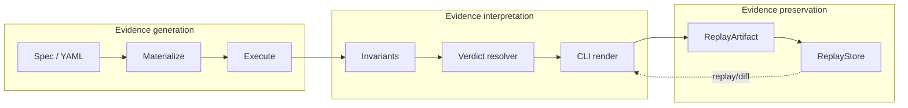

# FalsifyAI

> **FalsifyAI catches LLM regressions by perturbing inputs, preserving replayable evidence, and diffing reliability across model changes.**

**Accuracy benchmarks measure correctness. FalsifyAI measures reliability under pressure.**

Under the hood, it is a reliability evidence system for stochastic software.

[](https://github.com/ericckzhou/falsifyai/actions/workflows/ci.yml)
[](https://www.python.org)
[](LICENSE)

**Status:** 0.1.0 — Phase 0 MVP. Stable enough to use; spec language and verdict semantics are locked for the 0.1.x line.

```bash
pip install falsifyai
```

---

## You upgraded your model. Did anything break?

Most LLM evals tell you the new model passes its accuracy benchmark. That's not the same as *"the new model behaves like the old one under the same kinds of pressure your users will put on it."* FalsifyAI catches the gap.

The investigation takes three commands. Five minutes. One terminal.

### 1. Define what good looks like

Open [`examples/model_migration.yaml`](examples/model_migration.yaml):

```yaml
falsify:
  version: "1.0"
  name: "Model migration regression test"
model:
  provider: openai
  model: gpt-4o-mini
run:
  seed: 42
cases:
  - id: factual_recall
    input: { text: "What is the capital of France?" }
    expected: { contains: ["Paris"] }
    perturbations:
      - { type: typo_noise, count: 3 }
      - { type: casing }
    invariants:
      - { type: contains, values: ["Paris"] }

  - id: structured_output
    input: { text: 'Reply ONLY with a JSON object of the form {"capital": "<city>"}. What is the capital of Japan?' }
    expected: { contains: ['"capital"', "Tokyo"] }
    perturbations:
      - { type: typo_noise, count: 2 }
      - { type: casing }
    invariants:
      - { type: contains, values: ['"capital"', "Tokyo"] }

  - id: extraction
    input: { text: "Extract only the email addresses from this text: Contact alice@example.com or bob@example.com for details. The deadline is Friday." }
    expected: { contains: ["alice@example.com", "bob@example.com"] }
    perturbations:
      - { type: typo_noise, count: 2 }
      - { type: casing }
    invariants:
      - { type: contains, values: ["alice@example.com", "bob@example.com"] }

  - id: policy_summary
    input: { text: "Summarize this refund policy in one sentence: Customers can request a refund within 30 days if the item is unused and the receipt is provided." }
    expected: { contains: ["30 days", "unused", "receipt"] }
    perturbations:
      - { type: typo_noise, count: 2 }
      - { type: casing }
    invariants:
      - { type: contains, values: ["30 days", "unused", "receipt"] }
```

Four cases. One obvious sanity anchor (*factual recall*) plus three production-shaped contracts: *structured output*, *extraction*, and *grounded policy summarization*. The mix is deliberate — a migration regression then looks like a behavioral pattern across contract types, not a single anecdote.

### 2. Run against your baseline model

```bash
$ falsifyai run examples/model_migration.yaml
case: factual_recall     verdict: STABLE  confidence: 0.95 (CI: 0.92-0.98)
case: structured_output  verdict: STABLE  confidence: 0.94 (CI: 0.91-0.97)
case: extraction         verdict: STABLE  confidence: 0.96 (CI: 0.93-0.99)
case: policy_summary     verdict: STABLE  confidence: 0.93 (CI: 0.90-0.97)
=================================================================
Session 7c4f...a201 -> .falsifyai/replays.db
4 cases, verdict STABLE, 0 FRAGILE, 0 CONSISTENTLY_WRONG
```

Exit code: `0`. Four contracts, four green rows. Note the session id (`7c4f...a201`) — that's your *known-good baseline*. Commit it to your repo if you want it durable.

### 3. Switch to the new model. Run again.

Change `model:` in the spec (or set a different `OPENAI_MODEL` env var), then:

```bash
$ falsifyai run examples/model_migration.yaml
case: factual_recall     verdict: STABLE              confidence: 0.94 (CI: 0.91-0.97)
case: structured_output  verdict: CONSISTENTLY_WRONG  confidence: 0.00 (CI: 0.00-0.00)
case: extraction         verdict: CONSISTENTLY_WRONG  confidence: 0.00 (CI: 0.00-0.00)
case: policy_summary     verdict: STABLE              confidence: 0.92 (CI: 0.88-0.96)
=================================================================
Session 9a32...b1f0 -> .falsifyai/replays.db
4 cases, verdict CONSISTENTLY_WRONG, 0 FRAGILE, 2 CONSISTENTLY_WRONG
```

Exit code: `2` (FAILURE). The new model still knows the capital of France and can still summarize the refund policy with the required terms — but it dropped the JSON envelope on structured output and refused to do the extraction. *Same model. Two contracts broken. Two unchanged.*

### 4. Diff the two runs

```bash
$ falsifyai diff 7c4f...a201 9a32...b1f0
Diff: baseline 7c4f...a201 -> candidate 9a32...b1f0
Store: .falsifyai/replays.db
=================================================================
case: extraction         baseline: STABLE (0.96)  candidate: CONSISTENTLY_WRONG (0.00)  REGRESSED
case: structured_output  baseline: STABLE (0.94)  candidate: CONSISTENTLY_WRONG (0.00)  REGRESSED
=================================================================
2 regressed, 0 improved, 2 unchanged, 0 other, 0 added, 0 removed
```

Exit code: `5` (REGRESSION). Only the rows that changed are shown — two regressions, two unchanged contracts compressed into the footer count. **The migration broke structured output and extraction, but preserved factual recall and policy grounding. That is a behavioral pattern, not an anecdote.**

One command, two verdict-class downgrades, one number your CI can gate on.

### 5. Replay any past session

```bash
$ falsifyai replay --latest
Loaded session 9a32...b1f0 · created_at 2026-05-21T... from .falsifyai/replays.db
case: capital_factual  verdict: CONSISTENTLY_WRONG  confidence: 0.00 (CI: 0.00-0.00)
=================================================================
1 case, verdict CONSISTENTLY_WRONG, ...
```

Replay is read-only. The verdict shown is the one assigned at run time — never re-resolved. The same evidence that triggered the regression alert is preserved indefinitely.

**That's the whole product.** `run` → `replay` → `diff` is one falsification workflow, not three commands.

---

## What just happened?

Five concepts, one screen each:

**Perturbations** generate small input variations a real user might produce — typos, casing changes, paraphrases later. The MVP ships `typo_noise` (character-level mutations) and `casing_variant` (UPPER / lower / Title).

**Invariants** judge whether a perturbed output is still *"the same answer"* as the original. `contains` checks for required substrings; `semantic_equivalence` compares embedding cosine similarity to a threshold.

**Verdicts** compress evidence into one of five labels per case:

| Verdict | Meaning | Exit |
|---|---|---|
| `STABLE` | All perturbations passed the invariants | 0 |
| `FRAGILE` | Some perturbations failed; model drifts under pressure | 1 |
| `CONSISTENTLY_WRONG` | Every output (including baseline) violates the ground truth | 2 |
| `INSUFFICIENT` | Not enough evidence to decide (too few perturbations) | 4 |
| `INVALID_EVAL` | The evaluation itself is invalid or contradictory | 2 |

Verdicts use **stratified bootstrap CI** — each perturbation family is resampled independently, and the worst-case CI lower bound wins. A model that survives typos but breaks under casing reports the *casing* stability number, not an aggregated average that hides the failure.

**Replay artifacts** preserve the full evidence trail per session — every perturbed input, every model output, every invariant judgment, the verdict, and the per-family stability distribution. Replay shows historical evidence; it does not re-resolve. The CLI compresses; the artifact preserves the receipts.

**Diff** compares two artifacts case-by-case. The regression criterion is a **binary verdict-class downgrade** — `STABLE → FRAGILE`, `STABLE → CONSISTENTLY_WRONG`, or `FRAGILE → CONSISTENTLY_WRONG`. A competent user can predict the exit code from the two verdicts; there are no hidden thresholds.

For the full philosophy — including why evidence density beats evidence volume, what *resolver inflation* is and why we resist it, and how the four pillars hang together — see [`docs/ARCHITECTURE.md`](docs/ARCHITECTURE.md).

---

## Architecture

Three layers, separated by design. Each new feature belongs in exactly one of them.



ASCII fallback (for PyPI / mobile readers):

```
  EVIDENCE GENERATION             EVIDENCE INTERPRETATION         EVIDENCE PRESERVATION
  ─────────────────────           ───────────────────────         ─────────────────────
  spec.yaml                       invariants                      ReplayArtifact
     │                            verdict resolver                ReplayStore
     ▼                            CLI render                            ▲
  materialize                            │                              │
     │                                   │                              │
     ▼                                   ▼                              │
  execute  ────────────────────────▶ judge ────────────▶ resolve ───────┘
                                                            │
                                       ┌── falsifyai run    │
                                       │── falsifyai replay │  (consumers read
                                       └── falsifyai diff   │   the artifact)
```

A future feature touches exactly one layer. Adaptive evidence collection is interpretation, not generation. A new perturbation family is generation, not interpretation. A new verdict shape is interpretation, not preservation. The separation is what keeps the resolver explainable as the project grows — see [`docs/ARCHITECTURE.md`](docs/ARCHITECTURE.md) and the philosophy section of [`CONTRIBUTING.md`](CONTRIBUTING.md).

---

## CLI reference

Three subcommands, one workflow:

```bash
falsifyai run <spec.yaml> [--store-path PATH]
falsifyai replay <session_id> [--store-path PATH]
falsifyai replay --latest      [--store-path PATH]
falsifyai diff <baseline_id> <candidate_id> [--store-path PATH]
```

| Exit code | Meaning |
|---:|---|
| 0 | SUCCESS — session verdict STABLE |
| 1 | DEGRADED — session verdict FRAGILE |
| 2 | FAILURE — session verdict CONSISTENTLY_WRONG or INVALID_EVAL |
| 3 | ERROR — infrastructure failure (bad spec, missing credential, model call failure) |
| 4 | INSUFFICIENT — not enough evidence to decide |
| 5 | REGRESSION — `falsifyai diff` detected a verdict-class downgrade |

Default `--store-path` is `.falsifyai/replays.db`. Use `:memory:` for ephemeral runs (test-only; `replay` and `diff` need a persistent store).

---

## CI integration

The launch wedge in a GitHub Actions step:

```yaml
- name: Reliability regression gate
  env:
    OPENAI_API_KEY: ${{ secrets.OPENAI_API_KEY }}
  run: |
    KNOWN_GOOD="${{ vars.FALSIFYAI_BASELINE_SESSION_ID }}"
    falsifyai run eval.yaml
    CANDIDATE=$(sqlite3 .falsifyai/replays.db \
      "SELECT session_id FROM sessions ORDER BY created_at_iso DESC LIMIT 1;")
    falsifyai diff "$KNOWN_GOOD" "$CANDIDATE"
    # Exit 5 = regression; the job fails.
```

The `KNOWN_GOOD` variable is a session id you captured locally against the production model and committed as a repo / org variable. CI runs the eval against the candidate model and diffs — exit 5 (REGRESSION) fails the job. Zero thresholds to tune; the regression criterion is the verdict-class downgrade.

---

## Examples

Four dogfooded specs, all verified in CI ([`tests/integration/test_examples.py`](tests/integration/test_examples.py)):

| Example | Verdict | What it demonstrates |
|---|---|---|
| [`examples/stable.yaml`](examples/stable.yaml) | `STABLE` (exit 0) | A sane model under perturbation; both perturbation families + both invariants. |
| [`examples/fragile.yaml`](examples/fragile.yaml) | `FRAGILE` (exit 1) | Model drift: baseline correct, perturbations wrong. |
| [`examples/consistently_wrong.yaml`](examples/consistently_wrong.yaml) | `CONSISTENTLY_WRONG` (exit 2) | Confident hallucination: same wrong answer under every perturbation. |
| [`examples/model_migration.yaml`](examples/model_migration.yaml) | regression (exit 5) | The launch wedge — run twice, diff, exit 5 if any case regressed. |

Run any of them:

```bash
falsifyai run examples/stable.yaml
```

A real provider is required at runtime (`OPENAI_API_KEY` or the equivalent env var for your provider). The dogfood tests in CI bypass real model calls by injecting `MockAdapter` through a test seam — see [`tests/integration/test_examples.py`](tests/integration/test_examples.py) for the pattern.

---

## Writing your own spec

The shortest valid spec ([`tests/fixtures/specs/minimal.yaml`](tests/fixtures/specs/minimal.yaml)):

```yaml
falsify:
  version: "1.0"
  name: "minimal"
model:
  provider: openai
  model: gpt-4o-mini
run:
  seed: 42
cases:
  - id: hello
    input:
      text: "Say hi."
    perturbations:
      - type: typo_noise
    invariants:
      - type: contains
        values: ["hi"]
```

The full spec schema (perturbation parameters, invariant types, verdict thresholds) is in [`plan.md` §6](plan.md). The spec language is locked for the 0.1.x line.

---

## Local development

Requires Python 3.13+ and [`uv`](https://docs.astral.sh/uv/).

```bash
git clone https://github.com/ericckzhou/falsifyai
cd falsifyai
uv sync --extra dev
uv run pytest
```

Contributions follow the conventions in [`CONTRIBUTING.md`](CONTRIBUTING.md). Architectural constraints (especially: *resist resolver inflation*) are non-negotiable; see that doc for the trust test any resolver-touching PR must pass.

---

## Status and roadmap

**0.1.0 (this release) — Phase 0 MVP.** Spec language, perturbation runtime, materializer, invariants, execution adapter, replay store, real verdict resolver (stratified bootstrap CI, CONSISTENTLY_WRONG, falsifiability scoring), and the three-command CLI (`run` + `replay` + `diff`).

**Phase 1 (post-0.1.0).** Driven by real-world usage feedback. Likely additions: full `ConsistencyOracle` (embedding-based contradiction detection), `falsifyai history --case <id>` (time-series across sessions), `falsifyai inspect <session_id>` (deep-dive per-case view), exit code 6 (LOW_FALSIFIABILITY) wiring, `--strict` / `--show-trending` flags on `diff`, paraphrase + retrieval perturbation families, real-LiteLLM smoke testing in CI.

Phase 1 features will be evaluated against the question: *does this preserve evidence density and resolver predictability, or does it inflate the surface?* See [`docs/ARCHITECTURE.md`](docs/ARCHITECTURE.md) and [`CONTRIBUTING.md`](CONTRIBUTING.md) for the discipline.

---

## License

Apache 2.0 — see [LICENSE](LICENSE).
